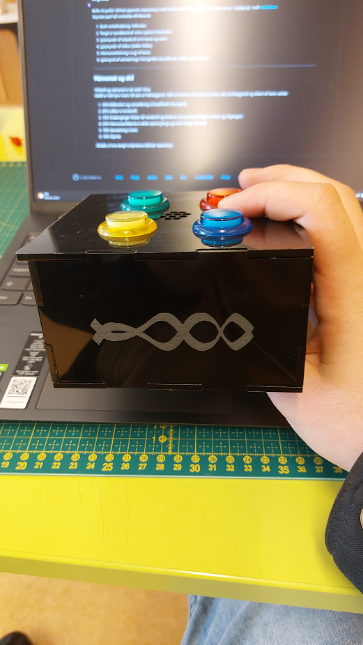

# Simon-says
#### Mikael Elí Axelsson

---

Í þessu verkefni vorum við að smíða spilið **Simon Says**. Við byrjuðum á því að gera spilið á brauðbretti og gerðum síðan kassa í inkscape þar sem við fengum þá laserskorna í framtíðarstofunni.

Hér er linkur á video hvernig spilið virkar https://drive.google.com/file/d/1fesGwYfEu0NwYNwV3u9IOOCKQAgE5Z0t/view?usp=sharing

---

Hér fyrir neðan koma nokkrar myndir að spilinu.

